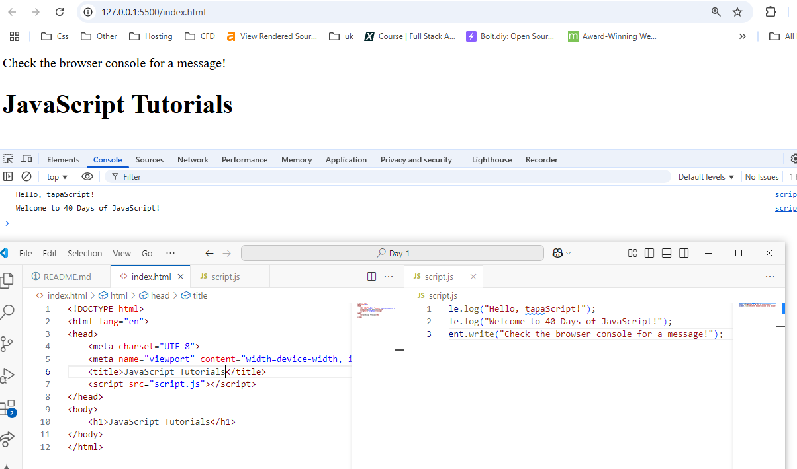
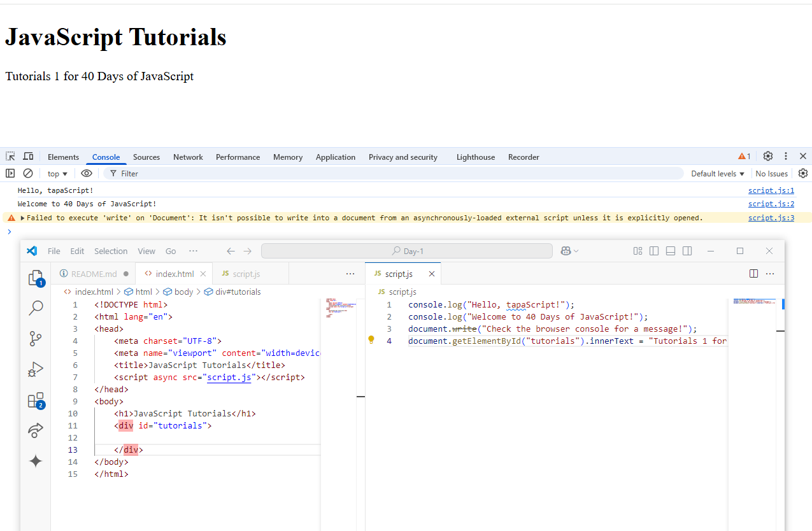
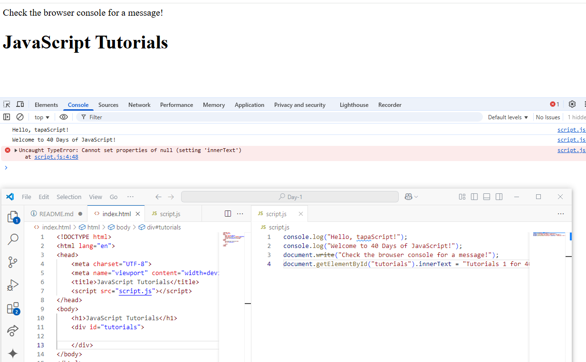
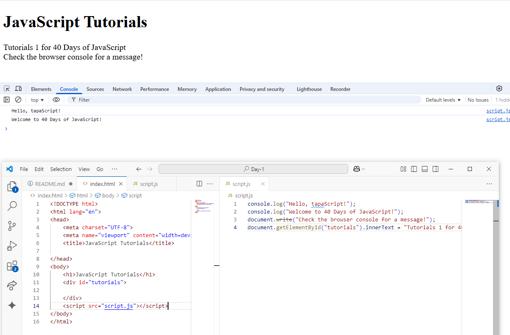

👩‍💻 🧑‍💻 Assignment Tasks

✅ Task 1: Setting Up Your Environment
        Install VS Code (if not installed).
        Set up Live Server or open the HTML file directly in a browser.
        Open the DevTools Console (Right-click → Inspect → Console).
    
    Done

✅ Task 2: Write Your First JavaScript Code
    1. Create a new file: index.html.
    
    2. Add a <script> tag inside the HTML file or link an external script.js.
    
    3. Inside script.js, write a simple greeting program:
    
        console.log("Hello, tapaScript!");
        console.log("Welcome to 40 Days of JavaScript!");
        document.write("Check the browser console for a message!");

    4. Run the HTML file in the browser and check:
       The console log prints the text.
       The document.write() outputs text on the webpage.

  

       
✅ Task 3: Experiment with Different JavaScript Loading Methods

        Add the script in <head>, end of the <body> tag.
        
        Use async and defer attributes
        
        Understand the difefrences.

 
  
   

        
✅ Task 4: Take Notes and Submit
        
