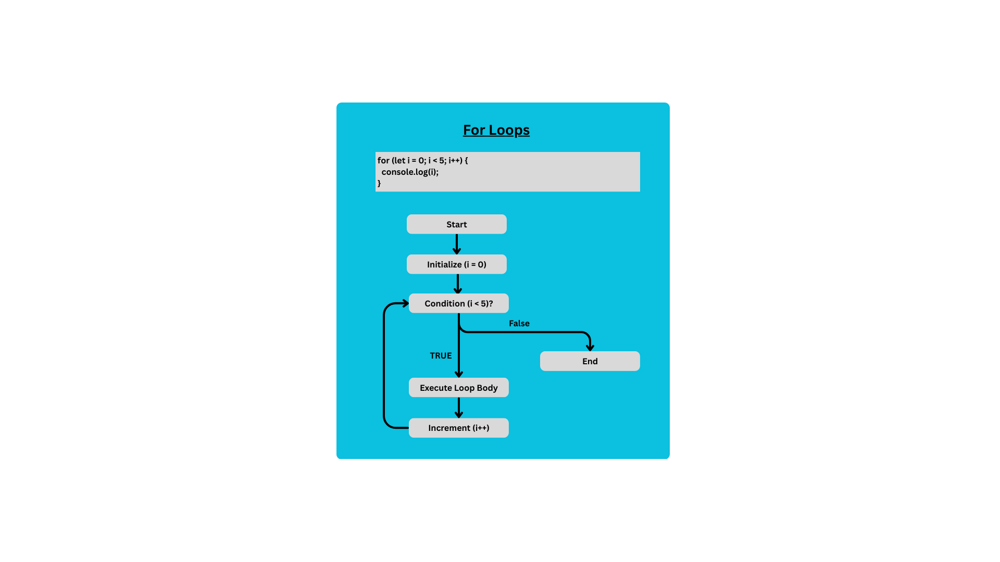
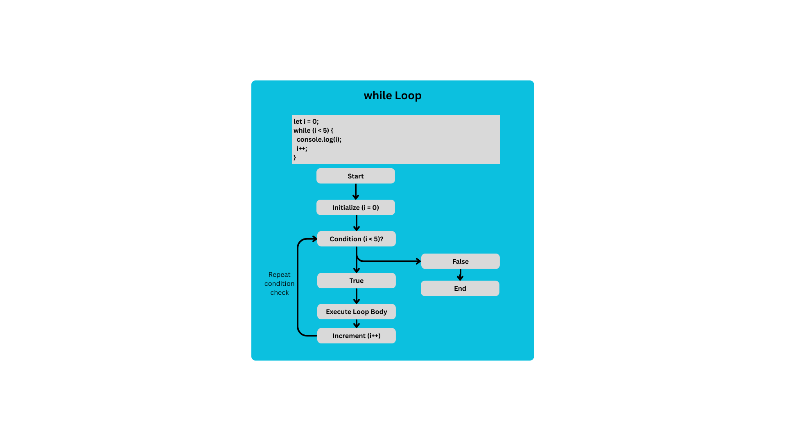
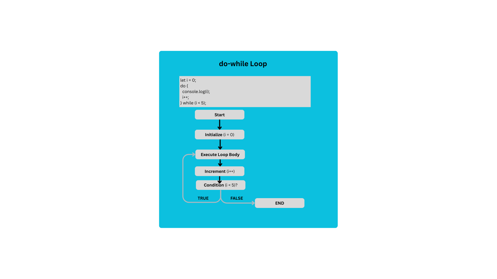

# Day 5 Task
## 1. Generate a Pyramid Pattern using Nested Loop

        let star = " *";
        for (let Pyramid = 0; Pyramid <= 5; Pyramid++) {
            console.log(star);
            star += " *";
        }

## 2. Generate a Multiplication Table using For Loop as it is shown below:

        let n=5;

        for (let result = 1; result <= 10; result++) {
            console.log(`${n} x ${result} = ${n * result}`);
        }

## 3. Find the Sum of Odd Numbers from 1 to 500 using For Loop:

        let sum = 0;
        for (let i = 1; i<= 500; i++) {
            if (i % 2 === 1) {
                sum += i;
            }
        }
        console.log("Sum of Odd Numbers", sum);

## 4. Skipping Multiples of 3

        for (let i = 1; i <= 20; i++) {
            if (i % 3 === 0) {
                continue;
            }
            console.log(i); 
        }

## 5. Reverse Digits of a Number (Using while loop)

        let number = "56789";
        let reversed = "";

        let i = number.length - 1;
        while (i >= 0) {
        reversed += number.charAt(i);
        i--;
        }

        console.log("Reverse Digits of a Number 56789 (string)", reversed);           
        console.log("Reverse Digits of a Number 56789 (Number)", +reversed);

## 6. Write your understanding on the difefrences between for, while, and do-while loop. Create their flow charts.
####🧠 Understanding the Differences:

       Loop Type	Initialization	Condition Check	        Execution Guarantee	        Best Use Case
        for	        At the top	Before each loop	Only if condition is true	Known number of iterations
        while        Before loop	Before each loop	Only if condition is true	Unknown number of iterations
        do-while	Before loop	After each loop	        At least once guaranteed	Run at least once, then check
## For Loops Flow Chart

## While Loops Flow Chart

## DO While Loops Flow Chart

