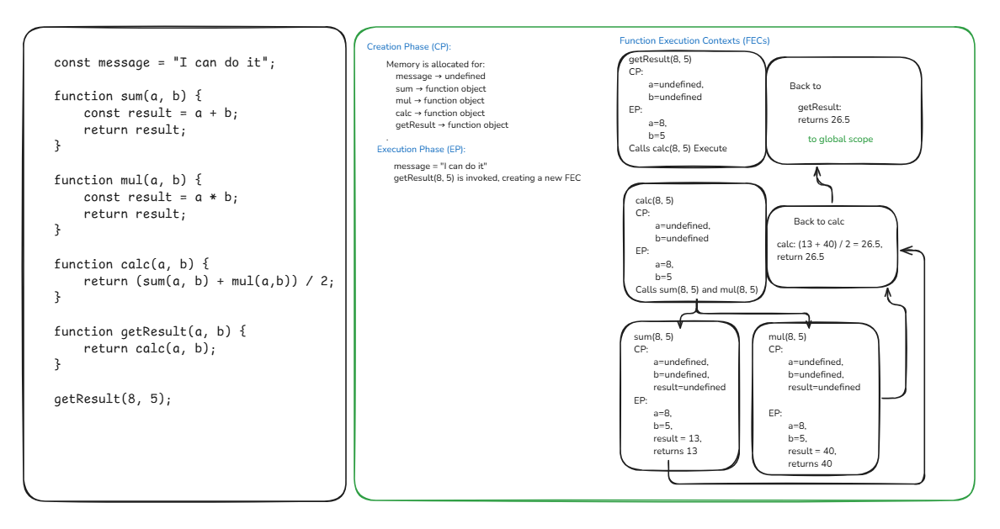
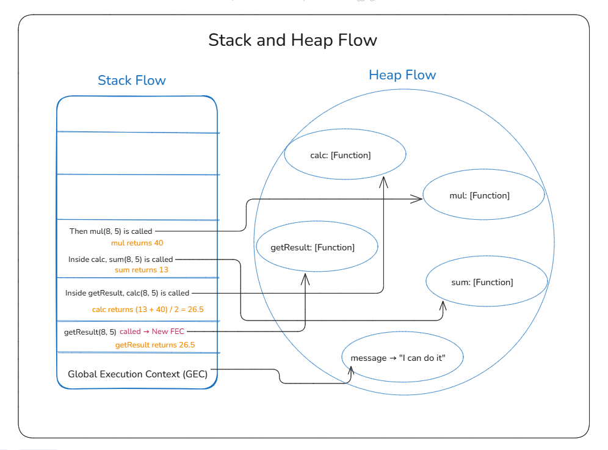
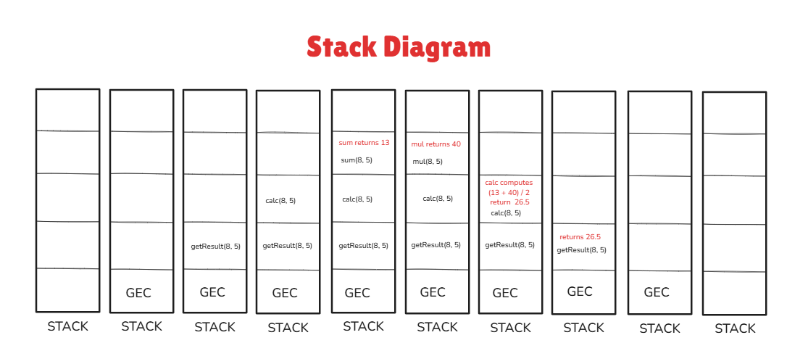

## Draw the Execution Context Diagram of the follwoing code and share as explained below:

            const message = "I can do it";

            fucntion sum(a, b) {
                const result = a + b;
                return result;
            }

            function mul(a, b) {
                const result = a * b;
                return result;
            }
            function calc(a, b) {
                return (sum(a, b) + mul(a,b))/2;
            }

            function getResult(a, b) {
                return calc(a, b);
            }

            getResult(8, 5);

### Create the GEC and FEC with CP and EP flow

### Create the Stack and Heap Flow

### Create the Stack Diagram
