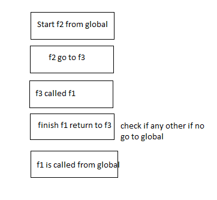

## Day - 6
### 1. Write a Function to Convert Celsius to Fahrenheit

        function temp (celsius) {
            const fahrenheit = (celsius * 9) / 5 + 32;
            console.log("Fahrenheit:", fahrenheit);
        }
        temp(0);

### 2. Create a Function to Find the Maximum of Two Numbers

        function findMax (a, b) {
            
            if (a > b) {
            return a;
            } else {
            return b;
            };
        }
        console.log("Maximum number is: ", findMax(10, 20));

### 3. Function to Check if a String is a Palindrome.

        function isPalindrome(str) {
        for (let i = 0; i < str.length / 2; i++) {
            if (str[i] !== str[str.length - 1 - i]) {
            return false;
            }
        }
        return true;
    //while

         while (str.length > 0) {
           if (str[0] !== str[str.length - 1]) {
            
            
             return false;
           }
           str = str.slice(1, str.length - 1);
         }
         return true;
    }
        console.log("Is 'racecar' a palindrome?", isPalindrome("racecar"));
        console.log("Is 'hello' a palindrome?", isPalindrome("hello"));
        console.log("Is 'RaceCar' a palindrome?", isPalindrome("RaceCar"));

### 4. Function to Calculate the Factorial of a Number.

        function factorial(n) {
        if (n === 0) {
            return 1;
        }

        return n * factorial(n - 1); 
        }

        console.log("Factorial of 5 is:", factorial(5)); // Output: 120

### 5. Function to Count the Number of Vowels in a String.

        function countVowels(str) {
        const vowels = "aeiouAEIOU";
        let count = 0;

        for (let i = 0; i < str.length; i++) {
            if (vowels.includes(str[i])) {
            count++;
            }
        }

        return count;
        }

        console.log("Number of vowels in 'Hello World':", countVowels("Hello World")); // Output: 3
        console.log("Number of vowels in 'Programming':", countVowels("Programming")); // Output: 3

### 6.  Write a Function to Capitalize the First Letter of Each Word in a Sentence

        function capitalizeFirstLetter(sentence) {
        const words = sentence.split(" ");
        const capitalizedWords = [];

        for (let i = 0; i < words.length; i++) {
            const word = words[i];
            const capitalizedWord = word.charAt(0).toUpperCase() + word.slice(1);
            capitalizedWords.push(capitalizedWord);
        }

        return capitalizedWords.join(" ");
        }

        console.log("Capitalized sentence:", capitalizeFirstLetter("hello world")); // Output: "Hello World"
        console.log("Capitalized sentence:", capitalizeFirstLetter("javascript is fun")); // Output: "Javascript Is Fun"

### 7. Use an IIFE to Print “Hello, JavaScript!"

        (function(count){
        console.log("Hello", count)
        })("JavaScript!");

### 8. Create a Simple Callback Function

        function greet(name) {
        console.log("Hello, " + name + "!");
        }

        function processUser(callback) {
        const userName = "Masum";
        callback(userName); 
        }

        processUser(greet); // Output: Hello, Masum!

### 9. Create Call Stack Execution Diagram for this flow:
        function f1() {
        console.log("f1 is called");
        }
        function f2() {
        console.log("Starting f2");
            f1();
        console.log("Done");
        }
        f2();

    // Starting f2 
    // f1 is called by f2
    // return to f2 and check other code "Done"

### 10. Create Call Stack Execution Diagram for this flow:

        function f1() {
            console.log("f1 is called");
        }
        function f2() {
        console.log("Starting f2");
        }
        function f3() {
        console.log("Starting f3");
            f1();
        console.log("f3 done");
        }
        f2();
        f3();
        f1();

    Starting f2 from global // Starting f3 from global // f1 is called by f3 // after complete f3 return to f3 done // f1 is called from global"

## Tracker Note: https://www.notion.so/Day-6-Function-1cd90af1268c814aa0a6dceaf2fe6efe?pvs=4